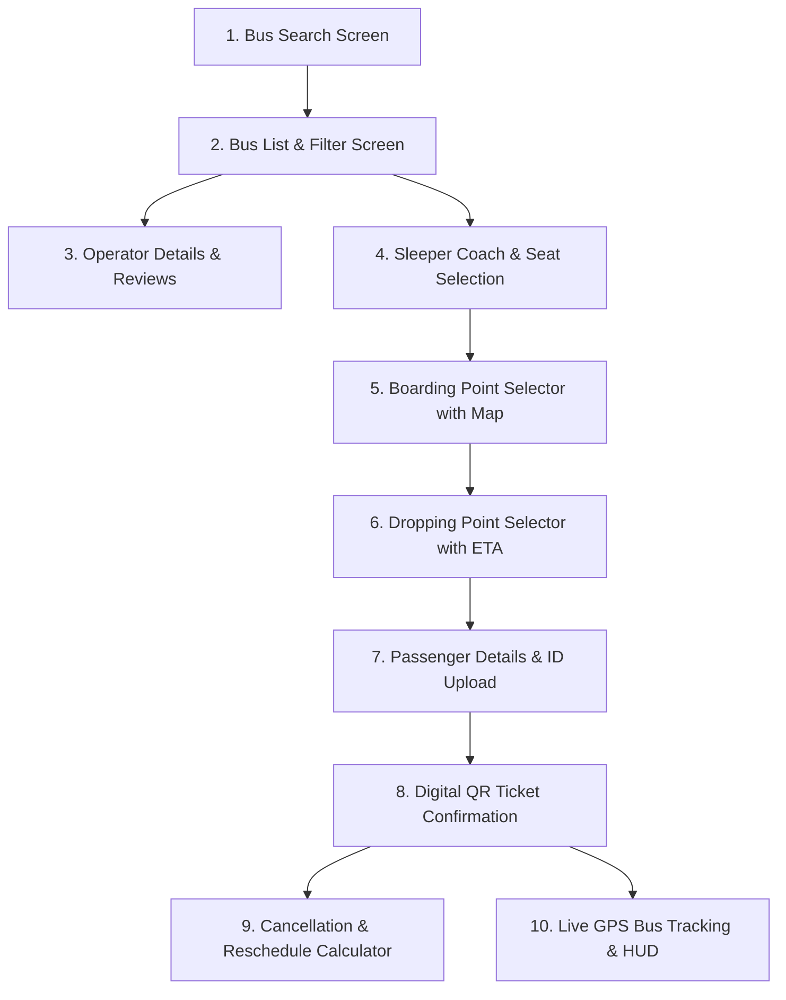

# 🚌 Laal Pari - Intercity Bus Booking System
### Case Study 116: RedBus Intercity Bus Booking Platform

Deploy link : https://laal-pari-black.vercel.app/

[](https://flutter.dev)
[](https://dart.dev)
[](#platform-support)
[-orange)](#zero-dependency-architecture)
[](#academic-metadata)

> **Course:** B.Tech Computer Science & Engineering (2024–28) — Semester V  
> **Subject:** Cross-Platform Mobile Application Development (Flutter)  
> **Institution:** ITM Skills University  
> **Industry Sector:** Bus Transportation & Travel-Tech  

---

## 📌 Table of Contents
1. [Project Overview](#-project-overview)
2. [Problem Statement & Solution Mapping](#-problem-statement--solution-mapping)
3. [Key Features & Highlights](#-key-features--highlights)
4. [Pricing & Dynamic Fare Strategy](#-pricing--dynamic-fare-strategy)
5. [System Architecture & 10-Screen Workflow](#-system-architecture--10-screen-workflow)
6. [Zero 3rd-Party Dependency Architecture](#-zero-3rd-party-dependency-architecture)
7. [Directory Structure](#-directory-structure)
8. [Setup & Running Locally](#-setup--running-locally)
9. [Viva Voce & Technical FAQ](#-viva-voce--technical-faq)

---

## 📖 Project Overview
**Laal Pari** (inspired by the iconic red-liveried intercity buses of India) is an enterprise-grade, cross-platform bus ticket reservation application built purely with **Flutter & Dart**. 

The application solves the critical pain points of intercity bus commuters by introducing:
- **Interactive Dual-Deck Sleeper Visualization** (Upper and Lower berths with true-to-life aspect ratios).
- **Map-Integrated Boarding & Dropping Point Pickers** with prominent landmark directions and scheduled arrival times.
- **Real-Time GPS Bus Telemetry** with digital speedometer HUD, highway rest stop timelines, and route deviation alert simulation.
- **Dynamic Demand-Driven Pricing Engine** with occupancy surges, round-trip concessions, partner bank cashbacks, and student verification discounts.
- **Automated Instant Cancellation & Refund Calculator** implementing transparent time-based deduction slabs.
- **Canvas-Rendered Offline QR Code Boarding Passes** generated entirely on-device without third-party libraries.

---

## 🎯 Problem Statement & Solution Mapping

| Problem Domain | Industry Pain Point | Implemented Solution in Laal Pari |
| :--- | :--- | :--- |
| **Coach Layout** | Flat 2D seating creates confusion between single/double and upper/lower sleeper berths. | **Dual-Deck Tabbed Visualizer** with custom berth geometries, headrest pillow accents, and real-time status indicators (Available, Booked, Selected). |
| **Pickup Locations** | Vague roadside stops lead to passenger delays and missed buses. | **Interactive Map Integration** displaying coordinate pins, landmark instructions (e.g. *Near Metro Pillar 42*), and live ETA offsets. |
| **Live Transit** | Commuters have zero visibility over bus location, speed, or rest halts. | **Dual-Mode Live GPS Tracking Engine** equipped with real Google Map integration, fallback vector map, speed gauge (km/h), and route deviation alerts. |
| **Search & Discovery** | Unsorted bus lists overwhelm travelers looking for specific comfort tiers. | **Multi-Facet Filter Sheet** covering Bus Types (AC Sleeper, Volvo, Seater), Departure Time slots, Price Range sliders, and Amenities toggles. |
| **Pricing Models** | Rigid static pricing fails to incentivize early bookings or specific commuter demographics. | **Algorithmic Dynamic Pricing** applying $+20\%$ surge for last 5 seats, $10\%$ round-trip discount, $5\%$ RBL card cashback, and $8\%$ student concession. |
| **Cancellations** | Opaque refund deductions and delayed customer service disputes. | **Instant Refund Calculator** simulating tiered deductions ($>24\text{h}: 80\%$, $12\text{--}24\text{h}: 50\%$, $<12\text{h}: 0\%$) with one-tap date rescheduling. |
| **Ticket Issuance** | Dependency on SMS or external network for boarding pass verification. | **Pure-Dart `CustomPainter` QR Generator** encoding booking ID, route, seat number, and passenger manifest into an offline-scannable matrix. |

---

## ✨ Key Features & Highlights

### 1. 🛏️ Interactive Sleeper Coach Layout
- **Deck Toggle:** Switch seamlessly between **Lower Deck** and **Upper Deck**.
- **Berth Configurations:** Supports 1x2 single sleeper (for privacy) and 2x2 double sleeper layouts as well as standard push-back seaters.
- **Visual Feedback:** 
  - ⚪ **White:** Available berth.
  - 🔘 **Grey:** Booked berth (touch-disabled).
  - 🔴 **Brand Red:** Selected berth (dynamically updates total payable amount).

### 2. 🗺️ Map-Based Boarding & Dropping Points
- City-specific pickup points (e.g., Pune Station, Wakad, Swargate, Viman Nagar).
- Interactive Google Maps integration with custom marker callouts and satellite/terrain layers.
- Drop points equipped with scheduled arrival times and transit duration calculations.

### 3. 🛰️ Live Telemetry & Safety HUD
- **GPS Simulation:** Bus coordinates update smoothly along the designated route.
- **Speedometer HUD:** Displays live cruise speed in km/h with threshold safety indicators.
- **Route Deviation Alert:** Triggerable safety alert warning if the vehicle diverges from the scheduled highway corridor.
- **Driver Profile Card:** Verified driver photograph, background check badge, commercial rating (e.g., $4.8\star$), and direct emergency dispatch.
- **Highway Rest Stops:** Details upcoming certified hygienic food courts, restroom breaks, and estimated arrival times (ETA).

### 4. 🏷️ Multi-Facet Filter Panel
- **Bus Types:** AC Sleeper, Volvo Multi-Axle, Non-AC Seater, Ordinary Express.
- **Time Slots:** Early Morning (< 6 AM), Morning (6 AM – 12 PM), Afternoon (12 PM – 6 PM), Night (> 6 PM).
- **Amenities Checklist:** Filter for Charging Points, Blankets, Mineral Water Bottles, Reading Lights, and TV/Entertainment.
- **Price Range:** Interactive dual-thumb range slider.

---

## 💰 Pricing & Dynamic Fare Strategy

Laal Pari implements an automated algorithmic pricing engine:

$$\text{Final Fare} = \left(\text{Base Fare} \times (1 + \text{Surge})\right) - \text{Discount}_{\text{RoundTrip}} - \text{Discount}_{\text{Bank}} - \text{Discount}_{\text{Student}}$$

- **Dynamic Occupancy Surge ($+20\%$):** Automatically triggers when $\le 5$ seats remain (or bus occupancy exceeds $85\%$).
- **Round-Trip Discount ($10\%$):** Automatically deducted from return journey bookings.
- **Partner Bank Cashback ($5\%$):** Applied when selecting partner cards (e.g., RBL Bank credit/debit cards).
- **Student Concession ($8\%$):** Applied on passenger fare upon entering and verifying student identity credentials.

### Transparent Cancellation Policy
- **$> 24$ hours before departure:** $80\%$ refund ($20\%$ processing fee).
- **$12$ to $24$ hours before departure:** $50\%$ refund ($50\%$ cancellation fee).
- **$< 12$ hours before departure:** Non-refundable ($0\%$ refund).

---

## 📱 System Architecture & 10-Screen Workflow

The application consists of 10 fully realized screens under [`lib/screens/`](file:///Users/ayushkumar/Desktop/Sem%205%28Cross%20Platform%29/lib/screens):



1. **`bus_search_screen.dart`**: Source/Destination input, quick location swap, departure date and return date selection.
2. **`bus_list_screen.dart`**: Search results with operator names, live seat availability, dynamic surge badges, and comprehensive filter drawer.
3. **`operator_details_screen.dart`**: Fleet history, driver certification, customer ratings, verified safety audit, and passenger reviews.
4. **`seat_selection_screen.dart`**: Multi-deck tabbed sleeper coach view, berth selection state, and live subtotal calculator.
5. **`boarding_point_screen.dart`**: Map-based boarding location selector with landmark guides and scheduled pickup timestamps.
6. **`dropping_point_screen.dart`**: Destination terminal selector with arrival estimates and transit times.
7. **`booking_details_screen.dart`**: Passenger manifest form (Name, Age, Gender, Contact), ID proof document upload simulator, concession toggles (Student & Bank discounts).
8. **`ticket_screen.dart`**: Digital boarding pass featuring a pure Dart canvas-generated QR code, passenger summary, and cancellation policies.
9. **`cancellation_reschedule_screen.dart`**: Real-time cancellation calculator displaying exact refund amounts and one-click date rescheduling.
10. **`live_tracking_screen.dart`**: Dual-mode interactive Google Map & vector fallback showing bus marker animation, speed HUD, and route deviation alert simulation.

---

## ⚡ Zero 3rd-Party Dependency Architecture
In strict adherence to academic rigor and core framework mastery:
- **No external pub packages:** Built with **zero** external UI or map dependencies.
- **Pure Canvas Drawing (`CustomPainter`):** Sleeper coaches, berth geometry, vector navigation maps, and QR code matrix generation are rendered entirely via Flutter's low-level `dart:ui` canvas.
- **Dual-Mode Mapping Engine:** Employs platform-agnostic web view/iframe interop on Web and an optimized vector rendering painter on native platforms.
- **No External Backend Needed:** High-fidelity in-memory state models and mock datasets simulate real-time operations without server overhead.

---

## 📂 Directory Structure

```text
Sem 5(Cross Platform)/
├── lib/
│   ├── data/
│   │   └── mock_data.dart                 # Pre-populated routes, buses, operators, and stops
│   ├── models/
│   │   └── models.dart                    # Bus, Seat, BoardingPoint, Passenger, and Ticket models
│   ├── screens/
│   │   ├── boarding_point_screen.dart     # Screen 5: Boarding point selection
│   │   ├── booking_details_screen.dart    # Screen 7: Passenger form & discount calculator
│   │   ├── bus_list_screen.dart           # Screen 2: Filterable bus discovery list
│   │   ├── bus_search_screen.dart         # Screen 1: Origin/Destination search & dates
│   │   ├── cancellation_reschedule_screen.dart # Screen 9: Cancellation & refund calculator
│   │   ├── dropping_point_screen.dart     # Screen 6: Dropping point selection with ETA
│   │   ├── live_tracking_screen.dart      # Screen 10: Real-time GPS bus tracking & HUD
│   │   ├── operator_details_screen.dart   # Screen 3: Driver details & operator reviews
│   │   ├── seat_selection_screen.dart     # Screen 4: Upper/Lower sleeper berth layout
│   │   └── ticket_screen.dart             # Screen 8: Digital QR ticket confirmation
│   ├── widgets/
│   │   ├── custom_map_paint.dart          # Pure Dart CustomPainter for vector maps & routes
│   │   ├── google_map_view.dart           # Dual-mode map wrapper
│   │   ├── interactive_google_map.dart    # Conditional export dispatcher
│   │   ├── interactive_google_map_stub.dart # Mobile native fallback painter
│   │   ├── interactive_google_map_web.dart  # Web platform view iframe connector
│   │   └── interactive_map_html.dart      # Embedded Google Maps JS engine
│   └── main.dart                          # App entry point & brand theme definitions
├── web/
│   ├── index.html                         # Web container & metadata (Laal Pari)
│   ├── interactive_map.html               # Google Maps web engine
│   └── manifest.json                      # Web app manifest
├── pubspec.yaml                           # Flutter configuration & SDK constraints
└── README.md                              # Comprehensive project documentation
```

---

## 🚀 Setup & Running Locally

### Prerequisites
- [Flutter SDK](https://docs.flutter.dev/get-started/install) (`v3.13.2` or higher)
- [Dart SDK](https://dart.dev/get-dart)
- Chrome Browser (for Web) or Android/iOS Emulator / Physical Device

### 1. Clone or Open the Workspace
```bash
cd "Sem 5(Cross Platform)"
```

### 2. Verify Flutter Environment
```bash
flutter doctor
```

### 3. Fetch Packages
```bash
flutter pub get
```

### 4. Run on Chrome (Web)
```bash
flutter run -d chrome
```

### 5. Run on Mobile (Android / iOS / macOS)
```bash
flutter run
```

### 6. Verify Code Quality & Lints
```bash
flutter analyze
```

---

## 🎓 Viva Voce & Technical FAQ

### Q1: Why was Flutter chosen for this project instead of native Android or React Native?
**Ans:** Flutter uses the Impeller/Skia rendering engine to compile directly to native ARM machine code without a JavaScript bridge (unlike React Native). This allows 60/120 FPS high-fidelity animations for the dual-deck sleeper berth selector and vector map rendering across Android, iOS, and Web from a single Dart codebase.

### Q2: How does the sleeper coach layout distinguish between upper and lower decks?
**Ans:** The layout uses a `DefaultTabController` with two distinct tabs (`Lower Deck` and `Upper Deck`). The seat models store deck tags (`Deck.lower` vs `Deck.upper`) and type properties (`SeatType.sleeper` vs `SeatType.seater`). Berths are rendered using custom aspect ratios ($2.2 : 1$) with rounded headrest pillow visual accents.

### Q3: How is dynamic surge pricing calculated?
**Ans:** Inside [`bus_list_screen.dart`](file:///Users/ayushkumar/Desktop/Sem%205%28Cross%20Platform%29/lib/screens/bus_list_screen.dart), an algorithm evaluates the remaining seat count. If $\text{seatsLeft} \le 5$, a $+20\%$ surge is calculated on top of the base fare, and a surge alert banner is dynamically attached to the ticket card.

### Q4: How is the QR Code generated without third-party packages?
**Ans:** The project implements a deterministic QR code visual generator inside [`ticket_screen.dart`](file:///Users/ayushkumar/Desktop/Sem%205%28Cross%20Platform%29/lib/screens/ticket_screen.dart) using `CustomPainter`. It computes a boolean matrix based on the booking reference ID string and paints 2D finder patterns and data modules directly to the Flutter canvas.

### Q5: How does the live tracking map function without paid map SDKs?
**Ans:** The app implements a **dual-mode engine**: on Web, it loads an embedded Google Maps iframe via `HtmlElementView`. On native platforms or offline environments, it falls back to [`custom_map_paint.dart`](file:///Users/ayushkumar/Desktop/Sem%205%28Cross%20Platform%29/lib/widgets/custom_map_paint.dart), which draws the highway corridor, bus marker, speed HUD, and route deviation alert dynamically using low-level canvas paths.

---

## 📜 Academic Declaration
This project is an authentic academic submission developed for the **B.Tech Computer Science & Engineering (Semester V) Cross-Platform Application Development** curriculum at **ITM Skills University**. All features, screens, calculations, and custom painters strictly satisfy the requirements of **Case Study 116**.
